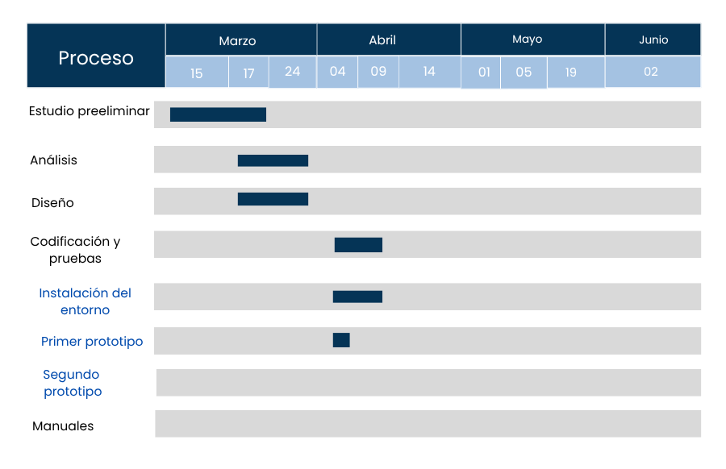

# Planificación

## Metodología prevista
El desarrollo del proyecto sigue una metodología incremental e iterativa, adaptada a las 
necesidades de un proyecto individual de pequeña escala.

En lugar de desarrollar el sistema completo de una sola vez, el trabajo se divide en prototipos 
funcionales que se van construyendo y probando de forma progresiva. Esto permite detectar errores 
en fases tempranas y ajustar el desarrollo según las necesidades reales del cliente.
## Fases planificadas

### Fase 1: Estudio preliminar
- **Período:** 15 de marzo – 17 de marzo
- **Descripción de las tareas:** Llamada con la dueña del Bar Salero Beach para identificar sus necesidades. Análisis de viabilidad y elección del stack tecnológic para asegurar que la aplicación sea moderna y fácil de desplegar.
- **Recursos necesarios:** Ordenador portátil, navegador web y herramientas de comunicación con el cliente.

### Fase 2: Análisis
- **Período:** 17 de marzo – 24 de marzo
- **Descripción de las tareas:** Definición de los requisitos del sistema (gestión de carta, pedidos y mesas). Creación de diagramas de flujo para entender cómo viajará la información desde el cliente hasta la base de datos.
- **Recursos necesarios:** Ordenador portátil y software para toma de notas y diagramación simple.

### Fase 3: Diseño
- **Período:** 17 de marzo – 24 de marzo
- **Descripción de las tareas:** Diseño de la estructura de la base de datos en MongoDB. Creación de prototipos visuales (diseño de las pantallas) y planificación de la arquitectura cliente-servidor mediante el uso de contenedores independientes.
- **Recursos necesarios:** Ordenador portátil, Figma (para el diseño visual) y MongoDB Compass.

### Fase 4: Codificación y pruebas
- **Descripción de las tareas:**
  1. **Instalación del entorno** (4 de abril – 9 de abril): Preparación de los archivos Docker para que el sistema funcione en contenedores.
  2. **Prototipo 1** (9 de abril – 14 de abril):*Programación del servidor (Backend) y conexión con la base de datos en la nube.
  3. **Prototipo 2** (15 de abril -5 de mayo): Desarrollo de la interfaz de usuario en React e integración con el servidor.
  4. **Prototipo Final** (5 de mayo -25 de mayo): Pruebas generales de funcionamiento, corrección de errores y despliegue definitivo en la plataforma Render.
- **Recursos necesarios:** Ordenador, Visual Studio Code, Docker Desktop y conexión a internet.

### Fase 5: Manuales del proyecto
- **Período:** *26 de mayo-28 de mayo*
- **Descripción de las tareas:** Elaboración del manual de usuario para el personal del bar (cómo gestionar pedidos) y un manual técnico básico que explique cómo levantar los contenedores de la aplicación.
- **Recursos necesarios:** Procesador de textos y herramientas para realizar capturas de pantalla.

---

## Calendario

