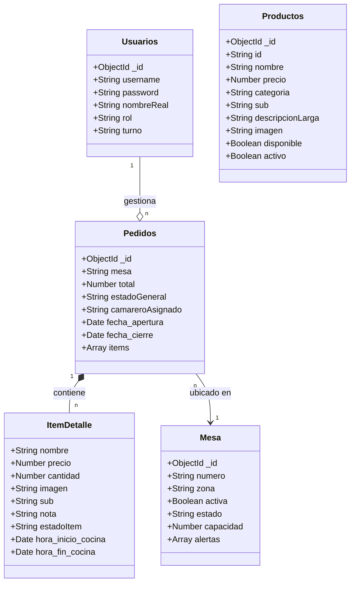
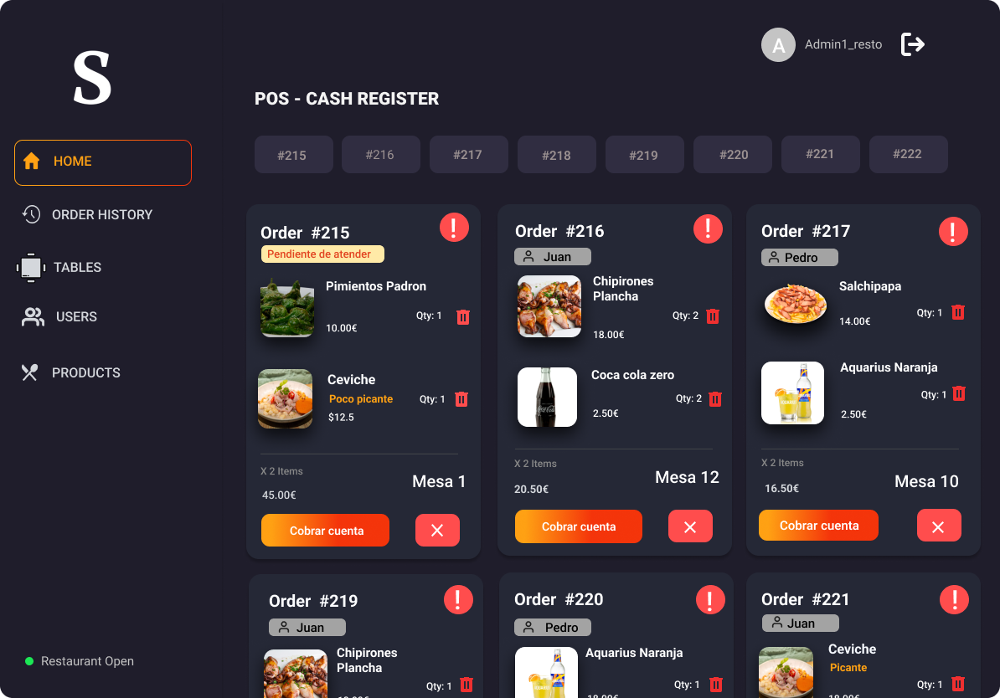
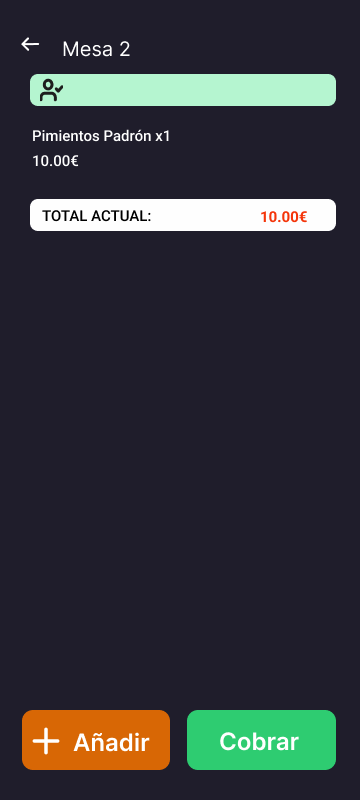

# Deseño

## Diagrama da arquitectura

## Diagrama de Base de Datos

Para el proyecto Salero Beach, se ha optado por un sistema de base de datos NoSQL orientado a documentos (MongoDB). A diferencia de los modelos relacionales tradicionales (MariaDB/MySQL), este modelo posibilita una flexibilidad y escalabilidad superiores, ya que se adecúa más eficazmente a la naturaleza cambiante de un menú de restaurante y a la rapidez que necesita el servicio de comandas.

## Deseño de interface de usuarios

### Interfaz para barra/cocina
### Login  
  
### Home-Barra  

### Historial de pedidos  

### Gestion de productos  

### Gestion de mesas  

### Home-Cocina  

## Interfaz del Comensal  
### Principal  

### Ver Todo

### Carrito

## Interfaz del camarero
### Principal

### Mesa seleccionada

