# Deseño

## Diagrama da arquitectura
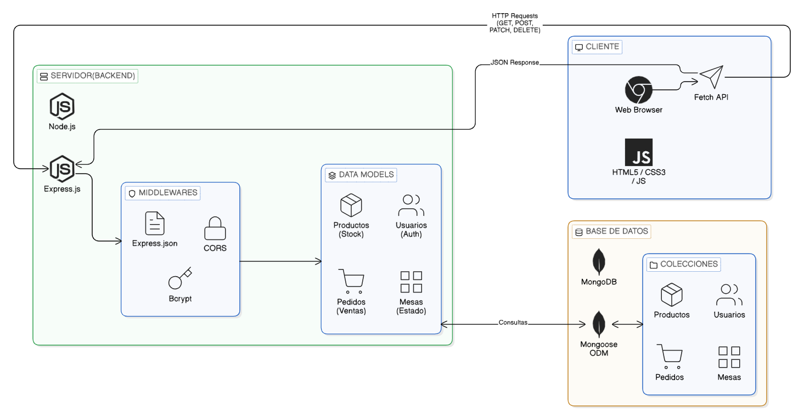

## Diagrama de Base de Datos
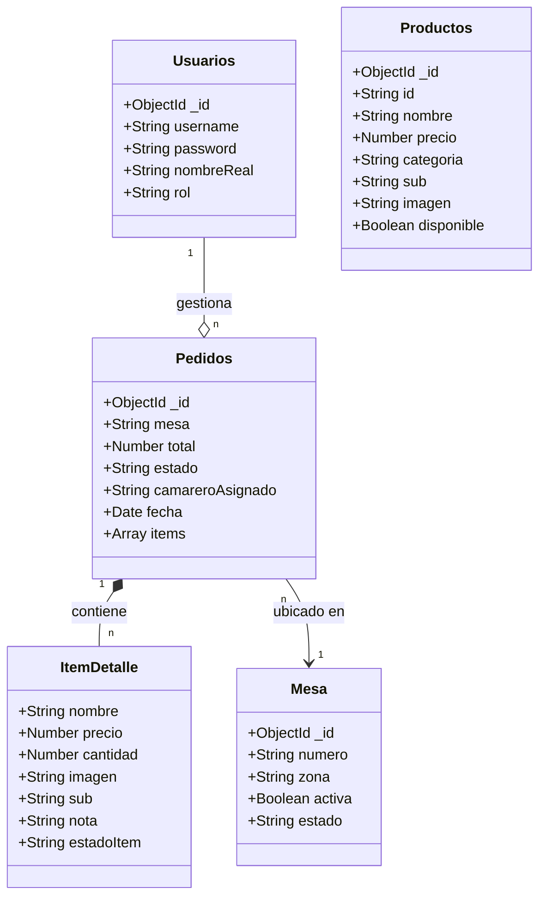

## Deseño de interface de usuarios

### Interfaz para barra/cocina
### Login  
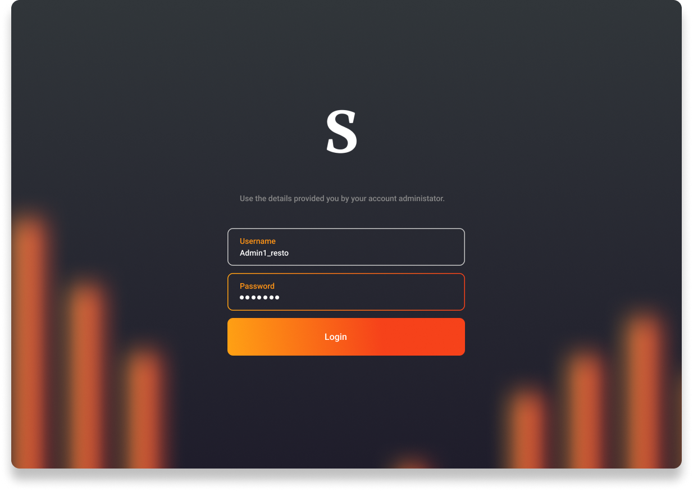  
### Home-Barra  
![home-barra] (../img/home-Barra.png)
### Historial de pedidos  
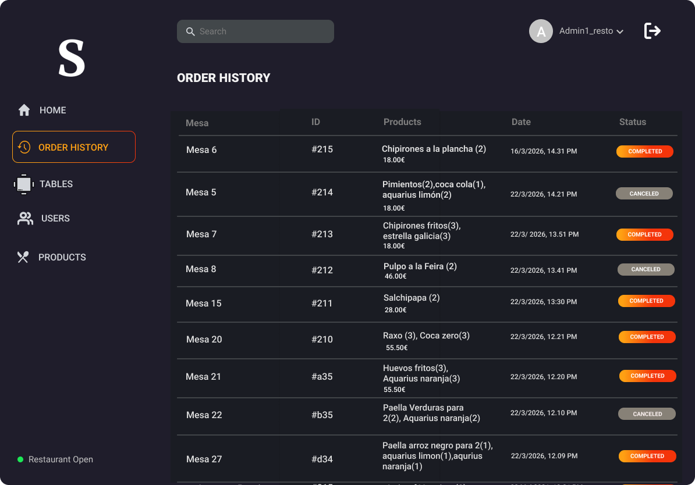
### Gestion de productos  
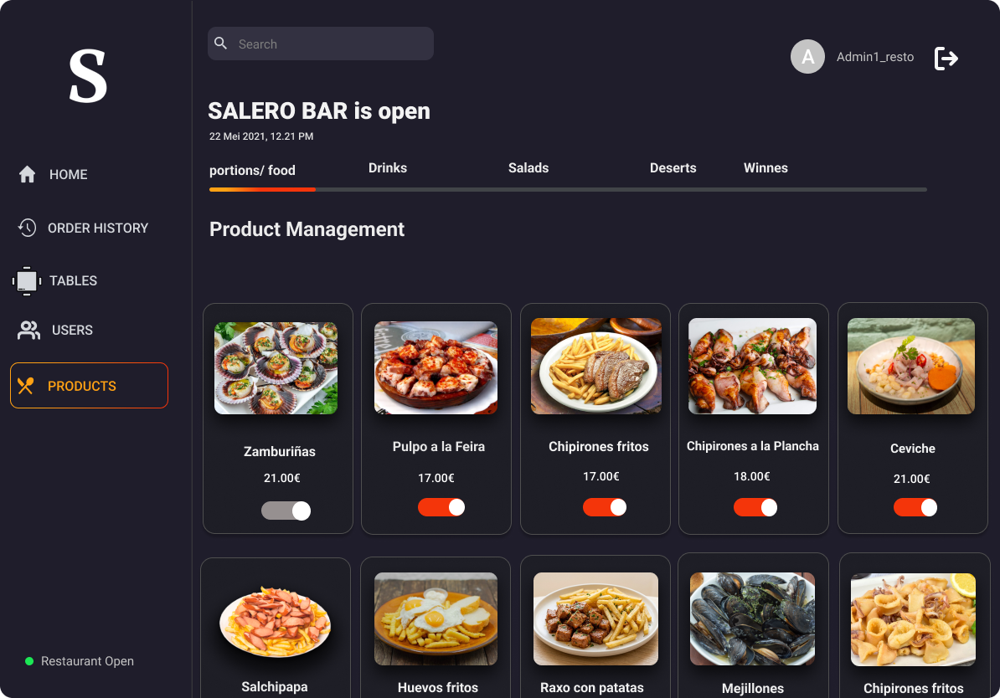
### Gestion de mesas  

### Home-Cocina  
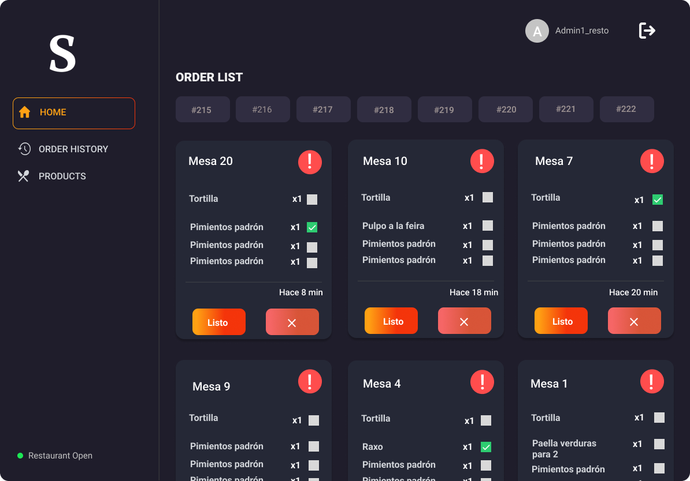
## Interfaz del Comensal  
### Principal  
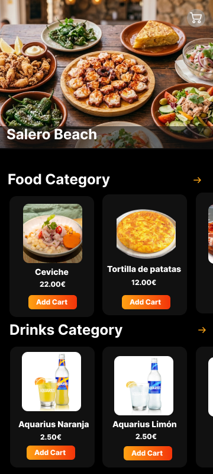
### Ver Todo
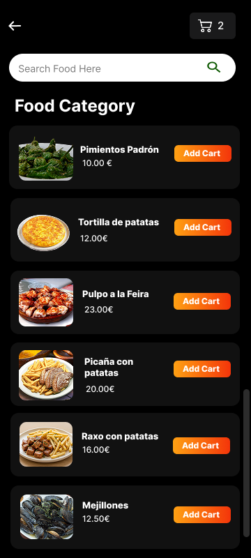
### Carrito
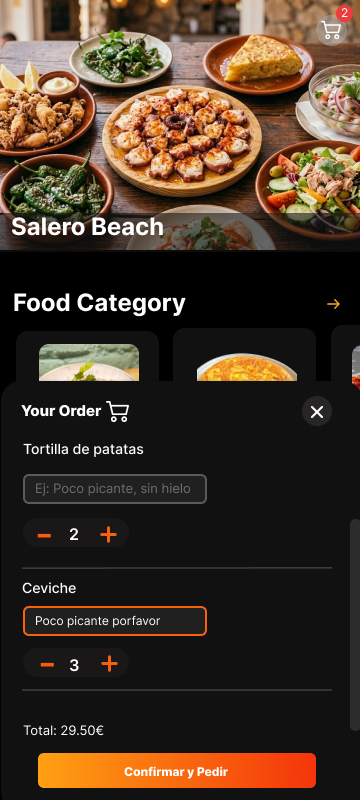
## Interfaz del camarero
### Principal
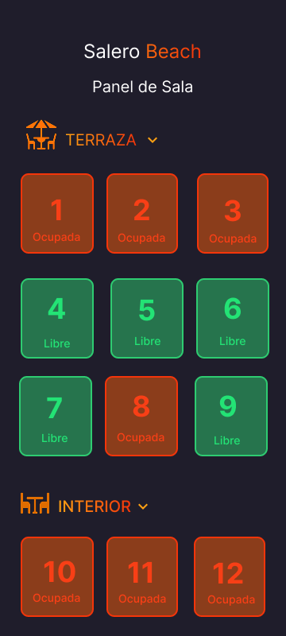
### Mesa seleccionada
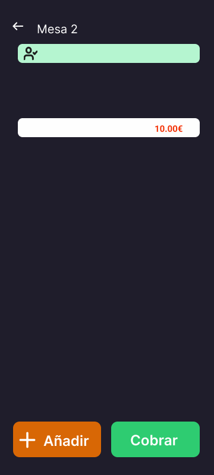

