# Manuais


## Manual técnico do proxecto

## Acceso a la Aplicación Desplegada

Para facilitar la evaluación del proyecto sin necesidad de realizar una instalación local, la aplicación se encuentra totalmente desplegada en: https://salerobeach-1.onrender.com

### Credenciales de Acceso para Pruebas

| Rol | Usuario  | Contraseña  |
| :--- | :--- | :--- |
| **Administrador**| `Admin_barra`  | `abc123.`  |
| **Camarero**| `treyci` | `abc123.` |
| **Cocina**  | `pedro` | `abc123.` |

## Instalación y ejecución Local


### 1. Clonar Repositorio
> git clone  https://github.com/EMAXSS05/SaleroBeach.git

>cd app 
### 2. Variables de Entorno

Crear el archivo app/.env con el siguiente contenido:
````
MONGO_URI=mongodb+srv://<usuario>:<password>@cluster0.pdg5oqs.mongodb.net/salero_beach
JWT_SECRET=salerobeach_secret_2024
````
### 3. Arrancar docker compose
>docker compose up -d --build

## Despliegue en Render
### 1. Backend — Web Service (Docker)

| Parámetro | Valor |
|---|---|
| Nombre del servicio | SaleroBeach |
| URL | https://salerobeach.onrender.com |
| Tipo | Web Service (Docker) |
| Repositorio | EMAXSS05/SaleroBeach (rama master) |
| Dockerfile Path | app/backend/Dockerfile |
| Root Directory | (vacío) |

**Variables de entorno configuradas en Render:**

| Variable | Valor |
|---|---|
| MONGO_URI | mongodb+srv://...@cluster0.pdg5oqs.mongodb.net/salero_beach |
| JWT_SECRET | salerobeach_secret_2024 |

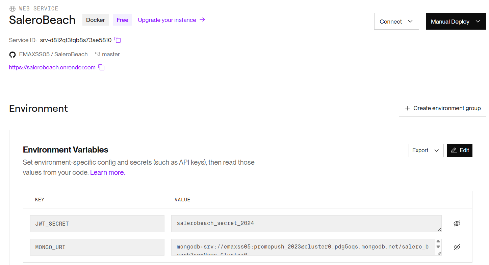

### 2. Frontend — Static Site

| Parámetro | Valor |
|---|---|
| URL | https://salerobeach-1.onrender.com |
| Tipo | Static Site |
| Repositorio | EMAXSS05/SaleroBeach (rama master) |
| Root Directory | app/frontend |
| Build Command | npm install && npm run build |
| Publish Directory | dist |

**Variable de entorno configurada en Render:**

| Variable | Valor |
|---|---|
| VITE_API_URL | https://salerobeach.onrender.com |

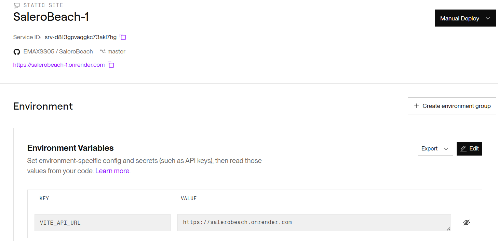

### Actualizar el despliegue

Render redespliega automáticamente al hacer push a la rama master de GitHub:

```bash
git add .
git commit -m "descripción del cambio"
git push github master
```


## Manual de Usuario

Se divide en 3 partes,una para cada rol del empleado en el establecimiento Salero Bar
### Barra, Camarero y Cocina
### 1. login
Deberá introducir los credenciales proporcionadas por el admin (la barra)

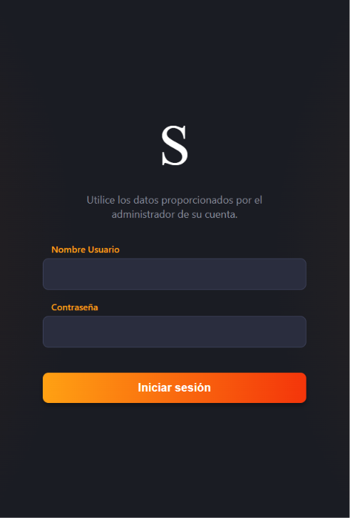
## Barra
Credenciales para iniciar sesión en la barra(admin): [credenciales admin](../templates/4_codificacion_probas.md)

### Apartura de la Caja
Al hacer login se abrirá un modal donde deberá introducir el saldo inicial antes de comenzar la jornada.

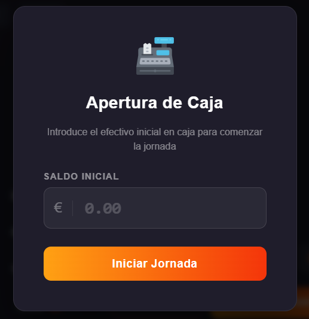
## Gestion de pedidos:
en la sección "Inicio" se podrán visualizar los pedidos que son enviados por los camareros, cada pedido muestra:
- Número de pedido.
- Alertas de la mesa.
- Los productos que contiene
- Notas de los platos, si los hay.
- Cantidad de cada producto.
- Número de mesa y el Total a cobrar.
- Un icono con singo de exlamación que es para resaltar que hay una alerta o nota en el pedido. 

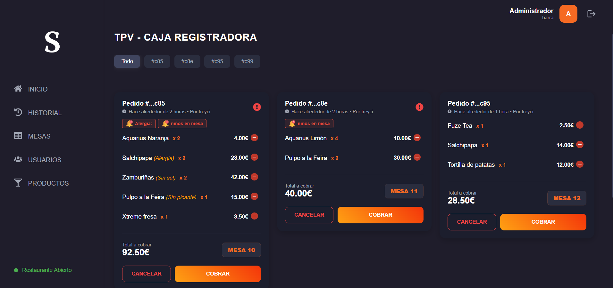
 ## Cobrar pedidos
Para cobrar los pedidos se debe pulsar en cobrar y seleccionar el método con el cual el cliente paga.

 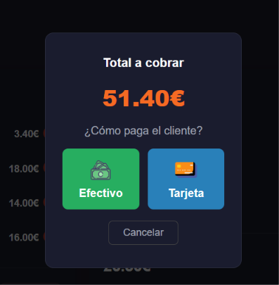

## Eliminar productos
Para eliminar productos se debe pulsar el siguiente botón el cual resta 1 a la cantidad de dicho producto del pedido.

 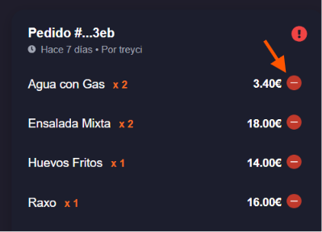

## Cancelar pedido
Debe pulsar el botón de cancelar, a continuación aparecerá un pop up en la parte superior,pulse en aceptar para confirmar la cancelación del pedido, al aceptar, este se moverá al historial de pedidos y aparecerá como CANCELADO

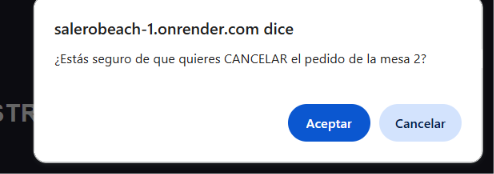

## Imprimir facturas


###  Factura Proforma:
1. Hacer clic en "Ticket"

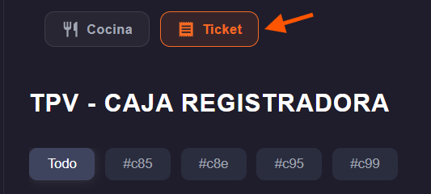

2. Seleccionar la mesa de la cual se desea imprimir la factura y hacer clic en Imprimir

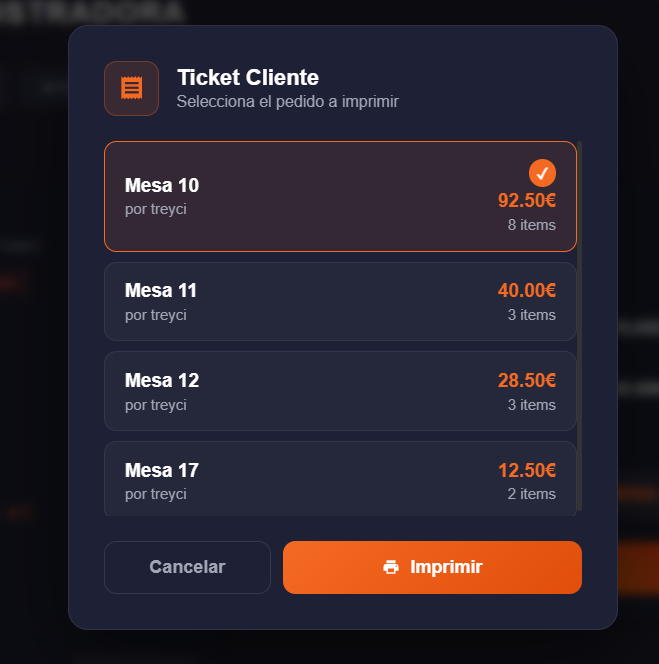

3. A continuacion se abrirá una pestaña en el navegador con la vista previa de la impresión, personalize las configuraciones a gusto y finalmente haga clic en Imprimir.

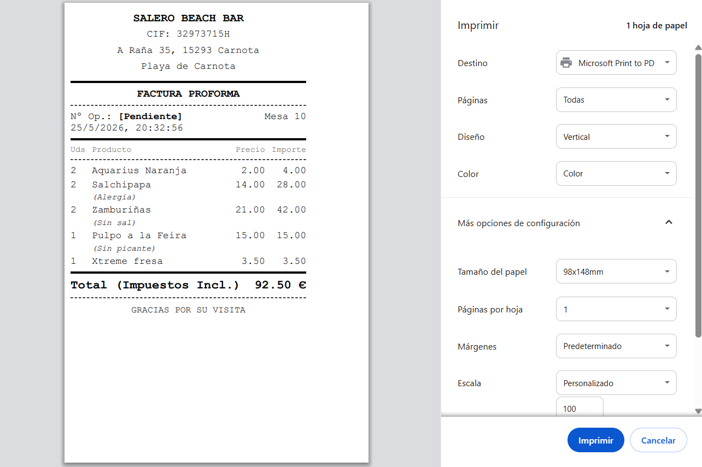

## Facura Simplificada

1. Después de seleccionar el método de pago deberá introducir la cantidad entrega y hacer clic en Confirmar Cobro


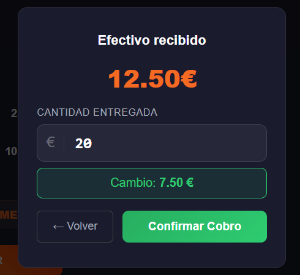

2. A continuación se abrirá un pop up y deberá hacer clic en Imprimir ticket.

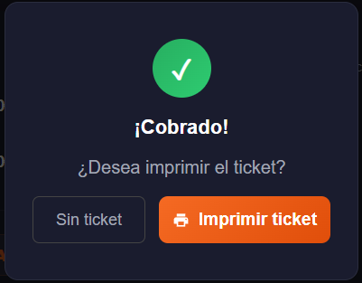

3. Luego se abrirá en el navegador la vista previa de la impresión, personalize las configuraciones para la impresión y haga clic en imprimir.

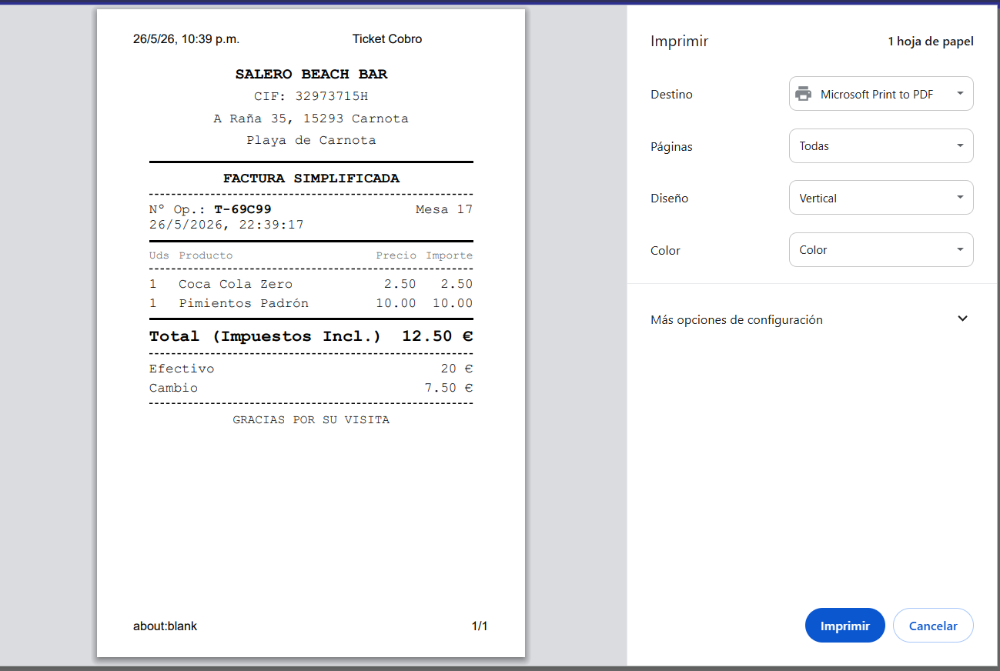

## Ticket Cocina
1. Hacer clic en el botón cocina.

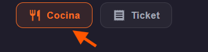

2. Seleccionar una mesa que tenga platos de comida o entrantes y hacer clic en Imprimir

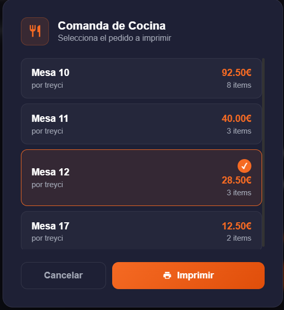

3. Se abrirá la vista previa de la impresión, personalize las configuraciones para la impresión y haga clic en Imprimir.

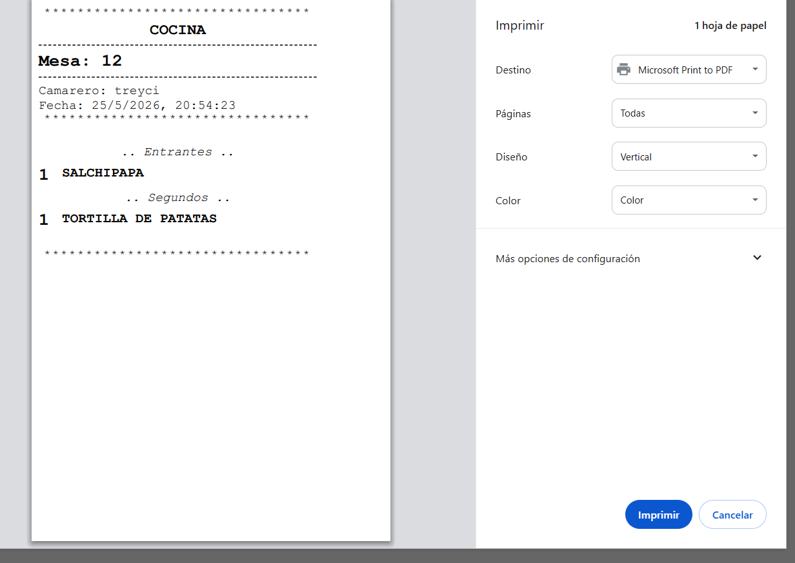


## Historial de Ventas
En esta sección se podrá visualizar el registro de todos los pedidos completados y cancelados, se puede filtrar por una fecha en concreto o por el numero de mesa, también se podrá ver la recaudación de dinero.

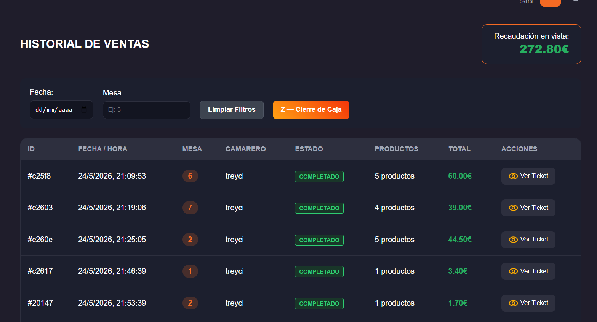
## Imprimir Z
1. Debe hacer clic en Z-Cierre de Caja

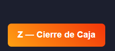

2. A continuación se le abrirá una vista previa del ticket con datos como el saldo inicial, los cobros que se hicieron con tarjeta y efectivo,etc.

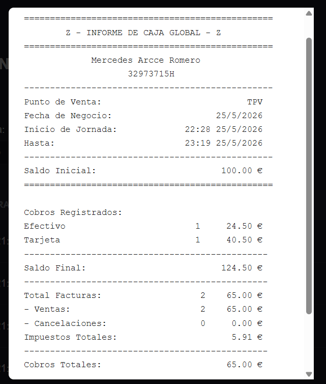

3. Hacer clic en imprimir para abrir la pestaña de la impresión:

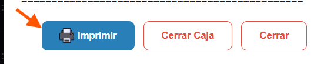

4. Personlizar la configuracion de la impresión y finalmente clic en imprimir

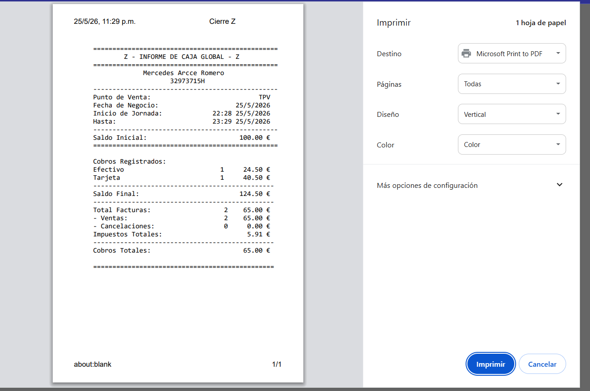

5. Una vez en imprimido el informe Z puede hacer clic en cerrar Caja, esto cerrará automáticamente la sesión, y reiniciará todos los datos para el comienzo de la próxima jornada

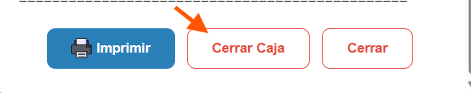

## Gestión De Mesas

Se puede dar de alta nuevas mesas, desactivarlas,y eliminarlas.

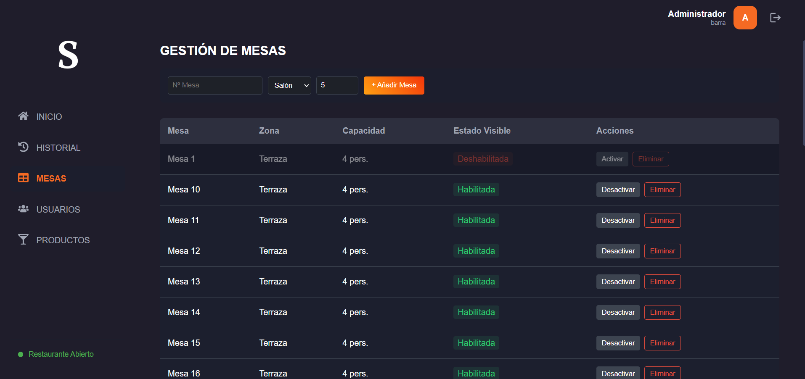

## Gestión de Personal

Se pueda dar de alta nuevos empleados, modficar la contraseña en caso de olvidarla y eliminar cuentas de empleados.

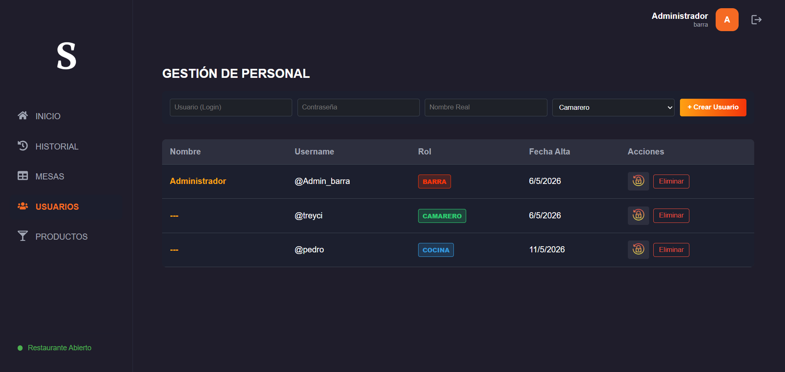

## Gestión de productos

Se puede dar de alta nuevos productos, modificar el precio, cambiar la imagen, desactivar y eliminar productos.

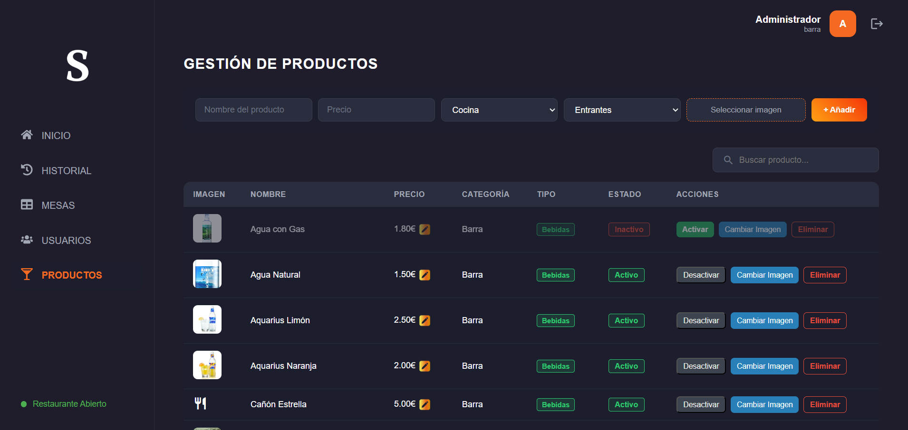

## Camarero

## Mapa de Mesas

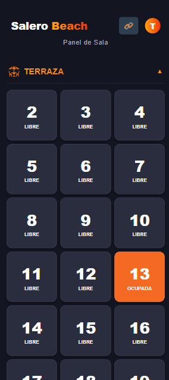 

## Unir Mesas
Seleccionar las mesas que se desean juntar.

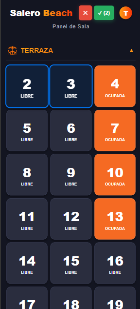

## Procedimiento para hacer un pedido

Hacer clic en una mesa y seleccionar el numero de personas para empezar el pedido o si es una mesa ocupada, dar clic en añadir más.

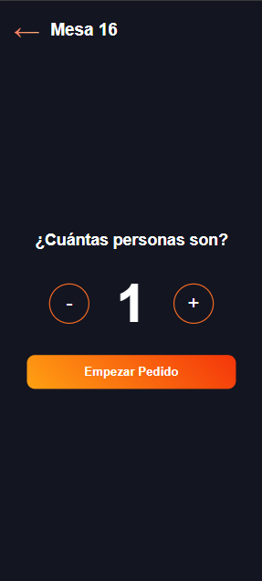   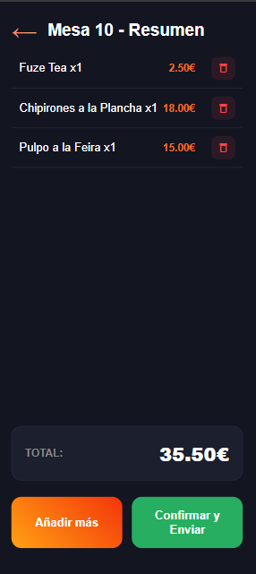 

-Debe seleccionar una alerta o necesidad para la mesa y posteriormente empieze a seleccionar las bebidas, entrantes, segundos y postres de la carta.

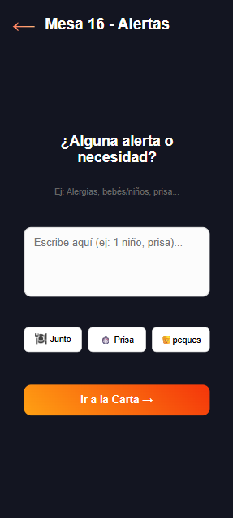 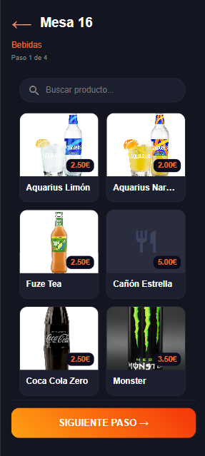 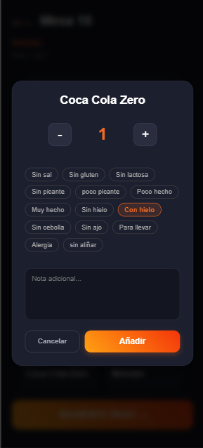

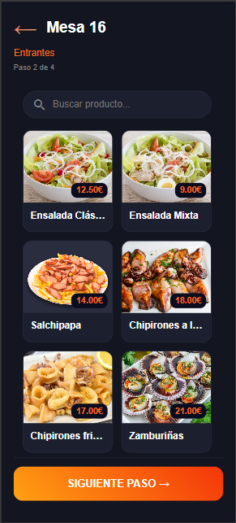 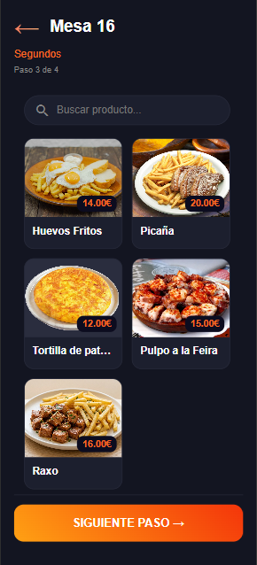 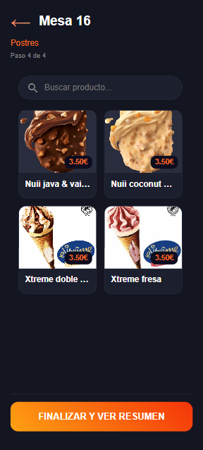

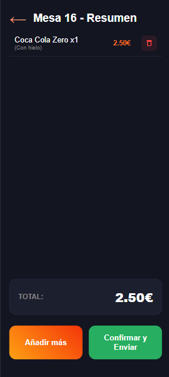

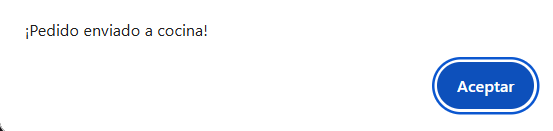

>Cuando Cocina avisa que un pedido está terminado, aparecerá en el mapa de las mesas de la siguiente manera:

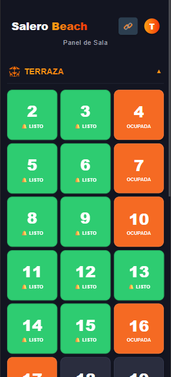

## Eliminar un producto del pedido

Debe hacer clic en el ícono del tacho de basura y luego hacer clic en confirmar y Enviar.

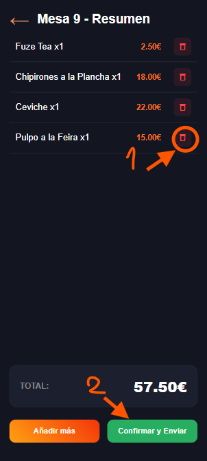


## Cocina

La Cocina tiene acceso a las siguientes secciones:
* **INICIO**
* **HISTORIAL** -> Ya explicado en la vista de la Barra
* **PRODUCTOS** -> Ya explicado en la vista de la Barra

### INICIO — Comandas de Cocina

Muestra todas las comandas activas enviadas por los camareros. 
Solo aparecen los platos de tipo **Entrantes** y **Segundos**.

Cada comanda muestra:
- **Número de mesa** (pueden ser mesas unidas, ej: Mesa 4 + 7 + 10)
- **Hora de apertura** del pedido
- **Alertas de mesa** — avisos importantes como "Mesa con prisa" 
  o "niños en mesa" (si los hay)
- **Lista de platos** con su estado actual

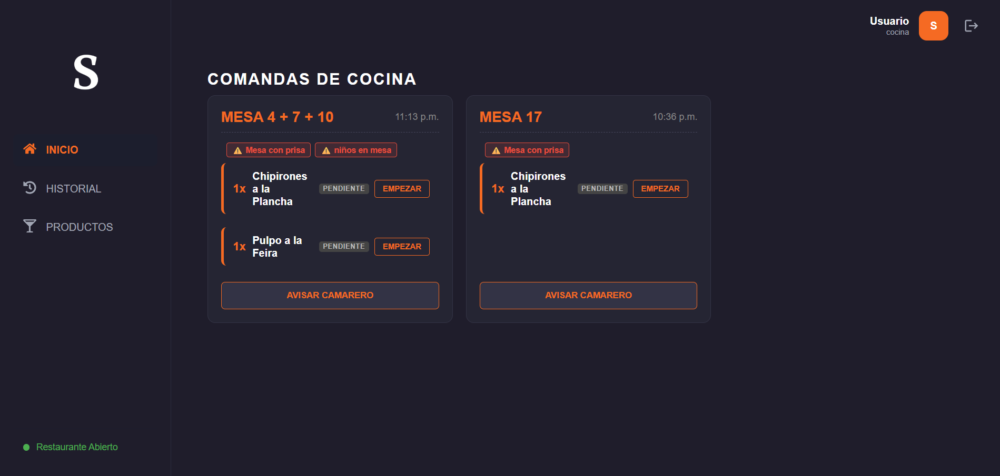

#### Estados de los platos

| Estado | Significado |
|---|---|
|  PENDIENTE | El plato aún no ha empezado a prepararse |
|  EN PREPARACIÓN | El cocinero ha empezado a prepararlo |
|  LISTO | El plato está listo para servir |

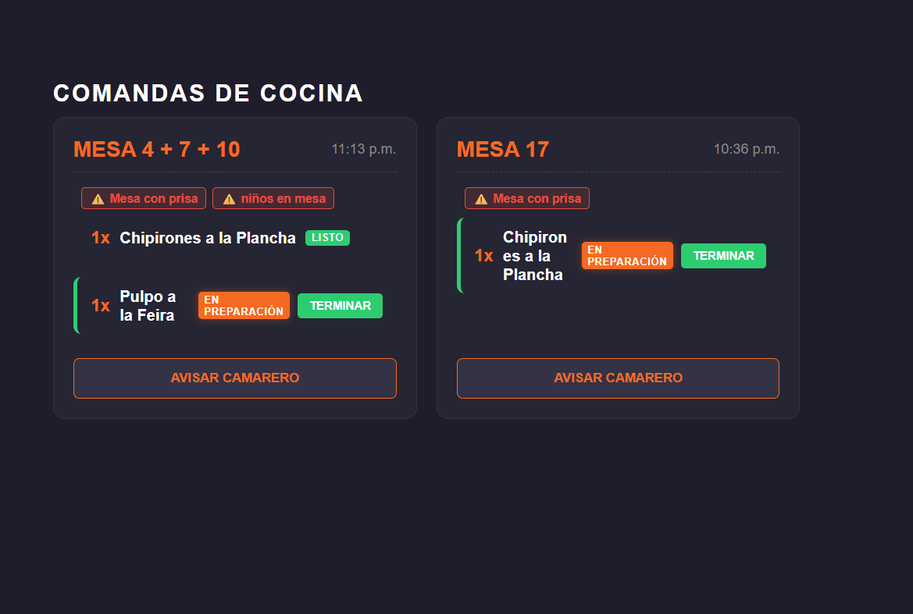

#### Flujo de trabajo

1. Al recibir una comanda nueva, los platos aparecen en estado **PENDIENTE**
2. Pulsar **EMPEZAR** cuando se comience a preparar el plato → pasa a **EN PREPARACIÓN**
3. Pulsar **TERMINAR** cuando el plato esté listo → pasa a **LISTO**
4. Cuando **todos** los platos de la comanda estén en estado LISTO, 
   se activa el botón **AVISAR CAMARERO**
5. Pulsar **AVISAR CAMARERO** para notificar que los platos están listos 
   para servir → la comanda desaparece de la vista

> El botón **AVISAR CAMARERO** permanece desactivado mientras haya 
> algún plato que no esté en estado LISTO.

---


### Cerrar sesión

Para cerrar sesión pulsar el icono de salida en la esquina superior derecha.


# Promoción
Esta aplicación o sistema se promocionará a través de redes sociales, en este caso escogí 3, Linkedin como la principal, secundarias serán Instagram y Facebook donde se publicará contenido sobre el uso de la aplicación e información para contactarme por si algun negocio se interesa y requiere este mismo sistema. 


# Modelo de Negocio

El modelo de negocio elegido para el desarrollo de este proyecto es un **modelo híbrido** que combina el **Desarrollo a Medida** con el **Modelo de Suscripción por Mantenimiento**.

Esta combinación es la que mejor se adapta a la realidad económica y operativa de un programador autónomo junior, garantizando la viabilidad del proyecto desde el primer momento. A continuación, se justifican detalladamente los motivos de esta elección.

---

## 1. Desarrollo a Medida

Este proyecto no nace como un producto comercial masivo, sino como una solución de software específica para un cliente directo. Por ello, se descartan modelos basados en publicidad o freemium, y se opta por el desarrollo a medida.

- **Financiación integral de los costes:** Al cerrar un precio de venta final de **3.490,00 €**, el cliente asume el coste total del desarrollo. Esto permite cubrir de forma inmediata los **1.750,00 €** correspondientes a la mano de obra propia (70 horas a 25 €/h), así como los costes operativos derivados de la actividad (alquiler de local, electricidad, internet, amortización del equipo y la cuota de autónomo).

- **Mitigación del riesgo y obtención de beneficio:** Como programador autónomo, el riesgo de imprevistos o períodos sin actividad es elevado. La aplicación del margen del 25% (+697,88 €) sobre los costes directos justifica el riesgo asumido y asegura un resultado económico positivo directo de **698,50 €** tras la entrega del producto.

- **Coste de adquisición cero:** Como se refleja en el presupuesto, el gasto en publicidad es de **0,00 €**. Al tratarse de un modelo B2B con un cliente ya fidelizado, no hay dilución de ingresos en estrategias de marketing.

---

## 2. Modelo de Suscripción

Una vez finalizado y entregado el software, el modelo de negocio evoluciona hacia una suscripción de servicios de soporte y mantenimiento.

- **Creación de ingresos recurrentes:** Se establece una cuota mensual de **20 €/mes**, lo que supone un ingreso anual de **240,00 €**. Para el autónomo, este modelo es clave, ya que ayuda a construir una base de ingresos predecibles y estables a lo largo del año, reduciendo la dependencia exclusiva de nuevos proyectos.

- **Valor añadido para el cliente:** El cliente no queda desatendido tras la entrega. Esta suscripción se justifica por ofrecer un servicio de resolución de errores (bugs), soporte técnico ante incidencias y optimización del sistema (aprovechando que los costes de infraestructura en la nube son actualmente de **0,00 €** gracias a los planes gratuitos de MongoDB Atlas y Render).

---

## Conclusión

En resumen, el modelo elegido transfiere el coste y el beneficio del desarrollo al cliente final mediante un **pago único por producto (In-house)**, y asegura la continuidad del servicio y la estabilidad financiera del autónomo a largo plazo mediante un **pago recurrente (Suscripción)**. Esta estructura garantiza que el proyecto sea rentable desde el mes uno, alcanzando un resultado económico total de **938,50 €** al cabo del primer año.


## Melloras futuras
Esta aplicación puede dar un salto en cuanto a automatizar la toma de pedidos, pienso en implementar la tercera vista, que sería para el cliente, donde él mismo desde su mesa al escanear el qr, pueda visualizar la carta completa y de este modo pueda realizar sus pedidos y que la barra y cocina, automáticamente los visualizen en su pantalla, además creo que no vendria mal una sección de estadísticas para ver más a detalle las ganacias del día, actualmente está en la sección de historial y por último me gustaría hacer que la aplicación funcione offline, ya que puede pasar que un día por algún motivo no haya wifi y se necesite acceder a la aplicación.
